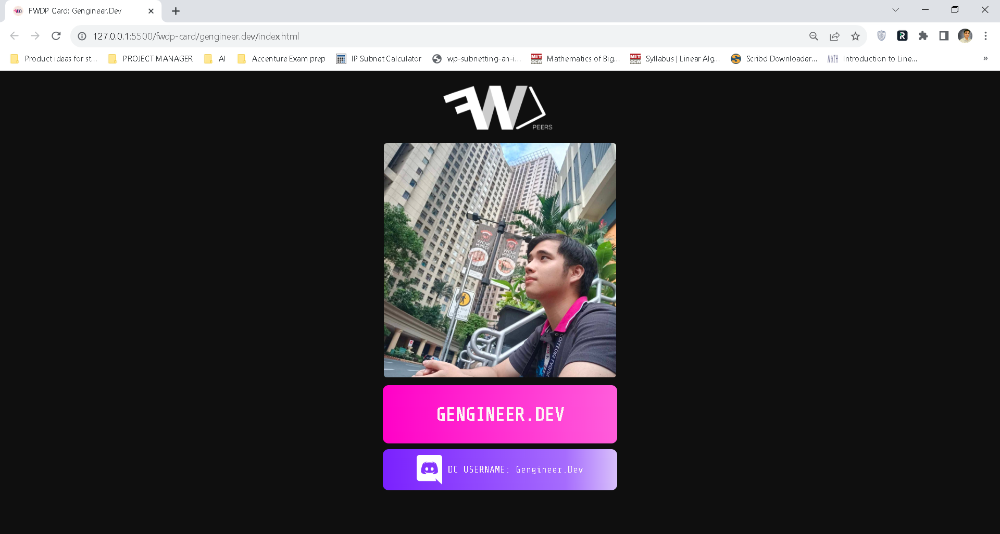

    
    <h3 align="center">FWDP Card</h3>
    
An awesome simple project to jumpstart your HTML/CSS/JS journey!

    <a href="https://github.com/FWDP/beginner-challenges/tree/main/fwdp-card/"><strong>Explore the docs »</strong></a>
     ·
    <a href="https://drive.google.com/file/d/1u7V5YoFtGlrjdfT0e-3hcX9oRkKqvK9_/view?usp=drive_link/"><strong>Watch Core Plus recording »</strong></a>
     
     

  
Table of Contents

  <ol>
    <li>
      <a href="#about-the-project">About The Project</a>
      <ul>
        <li><a href="#built-with">Built With</a></li>
      </ul>
    </li>
    <li>
      <a href="#getting-started">Getting Started</a>
      <ul>
        <li><a href="#prerequisites">Prerequisites</a></li>
      </ul>
    </li>
    <li><a href="#contributing">Contributing</a></li>
    <li><a href="#showcase-your-output">Showcase Your Output</a></li>
    <li><a href="#contact">Contact</a></li>
  </ol>

## About the Project

This project covers the basics of HTML and CSS to create an aesthetically pleasing card containing information that you can share with other FWDPeers!

It follows a simple project structure! All you have to do is to make an `assets` folder where you'll place your asets. Then, create `index.html` and `styles.css` files.

Create your own touch of this webpage: 

You can look at this Wonwoo's [sample FWDP card](https://drive.google.com/file/d/1yTUvnPl819hKA_LHvlRaMwroDkmpLOVi/view?usp=sharing) for inspiration.

(<a href="#readme-top">back to top</a>)

### Built With
* 
* 

(<a href="#readme-top">back to top</a>)

## Getting Started

### Prerequisites
1. Download the [assets](https://drive.google.com/drive/folders/1L6GqpsY3zHssujiPSXtG1_NzPNF9xq7i?usp=drive_link) used for the webpage.
2. Submit your GitHub username to this [form](https://forms.gle/A3kBieg6F1jLhhqP8) to be added as a contributor.
3. Install the following software.
- [Visual Studio Code](https://code.visualstudio.com/download)
- [GitHub Desktop](https://desktop.github.com/)
- [Git](https://git-scm.com/downloads)
4. To see updates on your output instantly, install the Live Server extension on Visual Studio Code. Read [here](https://www.alphr.com/vs-code-open-with-live-server/) for instructions on how to do that.

(<a href="#readme-top">back to top</a>)

## Contributing

If you are a part of the FWDP org here on GitHub, follow the steps below. If not, 

1. Create a new branch with this format: `develop/<DiscordName>`. You can create one using GitHub Desktop.
2. Inside the `fwdp-card` folder, make a folder and name it your GitHub username (e.g., `gengineer.dev`). If you already made your own FWDP card, copy and paste the project folder inside the `fwdp-card` folder, then rename it to your GitHub username.
3. Write some code. After that, [commit](https://docs.github.com/en/desktop/making-changes-in-a-branch/committing-and-reviewing-changes-to-your-project-in-github-desktop#write-a-commit-message-and-push-your-changes) and [push](https://docs.github.com/en/desktop/making-changes-in-a-branch/pushing-changes-to-github-from-github-desktop#pushing-changes-to-github) your changes to your branch. 
     
     - Make sure that your commit messages are written in present tense. Read more [here](https://gist.github.com/tonibardina/9290fbc7d605b4f86919426e614fe692). Take note of the [subject line terminology](https://gist.github.com/tonibardina/9290fbc7d605b4f86919426e614fe692?fbclid=IwAR2ZkV2N1wzppJL2SO-RzCiQVtw6GJ5XnKLufD2FrLFdloxljC9wHecTkYg#subject-line-standard-terminology).

After reviewing what you did, the maintainer or admin will merge it to the main branch.

(<a href="#readme-top">back to top</a>)

## Showcase Your Output

Goal: Reach 500 points on our [Facebook Group](https://fb.com/groups/fwdpeers) and Level 20 on [Discord](https://discord.com/servers/filipino-web-development-peers-996276138588524624)! If you reached it, you'll be eligible to receive the perks of an active Core Plus mentee!

You can start by sharing your FWDP card on these platforms!

On Discord, we recommend posting it in our **#💯・100-days-of-code** channel!

(<a href="#readme-top">back to top</a>)

## Contact
If you need help or have any questions, you can contact David Genesis Pedeglorio via Discord. 

Facebook: https://fb.com/gengineer.dev
 
LinkedIn: https://www.linkedin.com/in/david-genesis-pedeglorio/

(<a href="#readme-top">back to top</a>)

